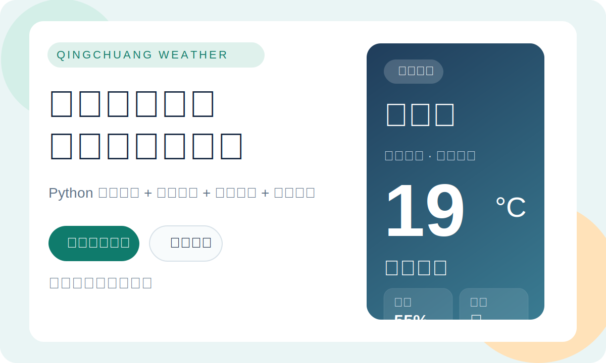
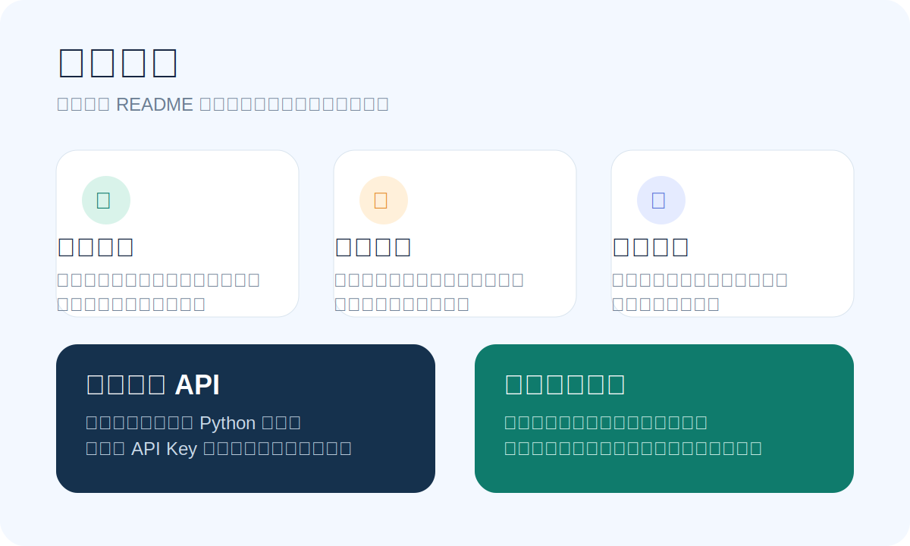
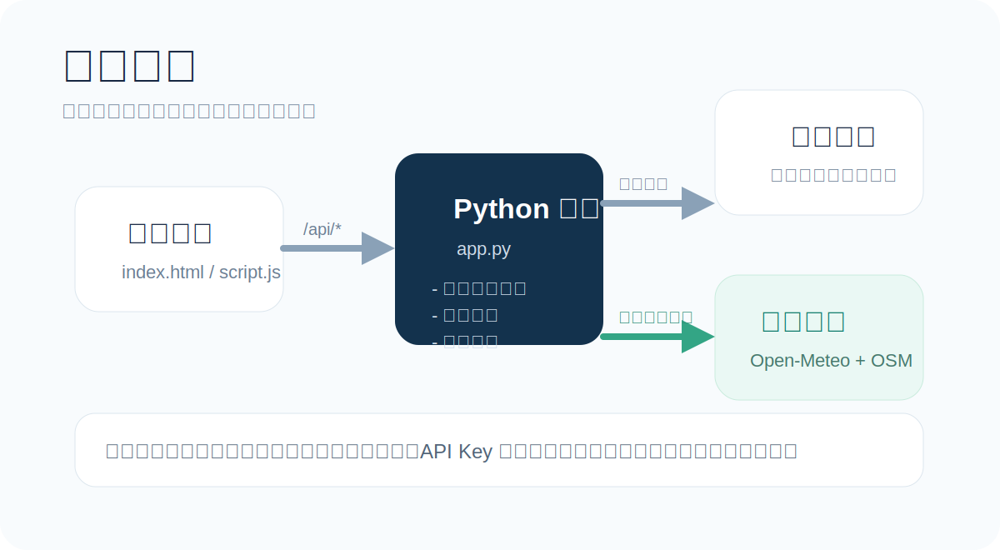

# 晴窗天气


一个基于 Python 后端的天气查询小应用，支持：

- 自动定位当前城市并显示实时天气
- 搜索城市或区县
- 手动按省、市、区县逐级选择
- 后端代理天气请求，前端不直接暴露 API Key
- 当高德接口在当前网络环境不可用时，自动回退到备用天气服务



## 亮点预览



## 工作流程



## 项目结构

- `app.py`：本地 Python 后端，负责静态资源、天气接口代理、定位反查和搜索接口
- `index.html`：前端页面
- `script.js`：前端交互逻辑
- `style.css`：页面样式
- `city_tree.json`：省市区层级数据
- `search_index.json`：城市搜索索引
- `amap-api-key.txt`：本地高德 Key 文件，不会上传到 GitHub

## 本地运行

确保你本机有 Python 3。

1. 在项目目录准备高德 Key 文件：

```txt
amap-api-key.txt
```

文件内容直接填写你的高德 Web 服务 Key。

2. 启动服务：

```bash
python3 app.py
```

3. 浏览器打开：

```txt
http://127.0.0.1:8000
```

## 说明

- 前端页面会优先尝试浏览器定位权限
- 如果当前环境访问高德接口异常，后端会自动尝试备用天气数据源
- `amap-api-key.txt` 已加入 `.gitignore`，默认不会被提交
